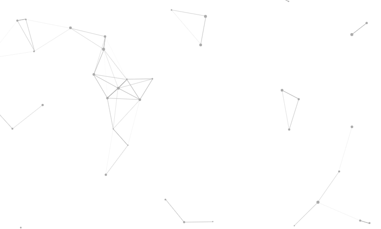

# particle-field
canvas实现粒子场的动画效果

实现效果：粒子会动并且在一定范围内粒子之间出现连线。

 

[演示](https://duobe.github.io/particle-field/)

[源码](https://github.com/Duobe/particle-field)

> 以下是实现过程

## 一、获取canvas对象和画笔

``` JavaScript
var canvas = document.getElementById("canvas")
var ctx = canvas.getContext("2d")
// 保存canvas的宽、高
var w = canvas.offsetWidth
var h = canvas.offsetHeight
// 注意：canvas实际有2套尺寸，一个是本身大小，另一个是绘图表面的大小，这里处理使它们大小一致，不然会出现拉伸情况
canvas.width = w
canvas.height = h
```

## 二、创建点的类

从效果上看有很多个点，每个点都有它们有相同的属性比如坐标、半径、速度等

``` javascript
function Point(x, y) {
	this.x = x 
	this.y = y
	this.r = 1 + Math.random() * 2
	this.sx = Math.random() * 2 - 1
	this.sy = Math.random() * 2 - 1
}
```

## 三、给Point添加画点的方法

首先画布是没有东西的，所以先有了```点 ```才可以继续下去动作

``` JavaScript
Point.prototype.draw = function(ctx) {
	ctx.beginPath()
	ctx.arc(this.x, this.y, this.r, 0, 2 * Math.PI)
	ctx.closePath()
	ctx.fillStyle = '#aaa'
	ctx.fill()
}
```

## 四、给Point添加点的动作

``` JavaScript
Point.prototype.move = function() {
	this.x += this.sx
	this.y += this.sy
	if(this.x > w || this.x < 0) this.sx = -this.sx
	if(this.y > h || this.y < 0) this.sy = -this.sy
}
```

## 五、点与点之间的连接 —— 画线

``` JavaScript
Point.prototype.drawLine = function(ctx, p) {
	var dx = this.x - p.x 
	var dy = this.y - p.y
	var d = Math.sqrt(dx * dx + dy * dy)
	if(d < 100) {
		var alpha = (100 - d) / 100 * 1 
		ctx.beginPath()
		ctx.moveTo(this.x, this.y)
		ctx.lineTo(p.x, p.y)
		ctx.closePath()
		ctx.strokeStyle = 'rgba(170, 170, 170, ' + alpha + ')'
		ctx.strokeWidth = 1
		ctx.stroke()
	}
}
```

## 六、实例化点

现在才开始拿到那些点，并把每个点放在一个数组里面保存。

``` JavaScript
var points = []

for(var i = 0; i < 40; i++) {
	points.push(new Point(Math.random() * w, Math.random() * h))
}
```

## 七、画点

把放在points数组里面的点一个个拿出来，调用上面写好点的方法：画点（draw）、点会动（move）、点连线，最后调用 paint() 方法执行。

``` JavaScript
function paint() {
	ctx.clearRect(0, 0, w, h) //清空画布
	for(var i = 0; i < points.length; i++) {
		points[i].move() 
		points[i].draw(ctx)
		for(var j = i + 1; j < points.length; j++) {
			points[i].drawLine(ctx, points[j])
		}
	}
}
// 这里使用requestAnimationFrame更新画面
function loop() {
	requestAnimationFrame(loop)
	paint()
}
loop()
```